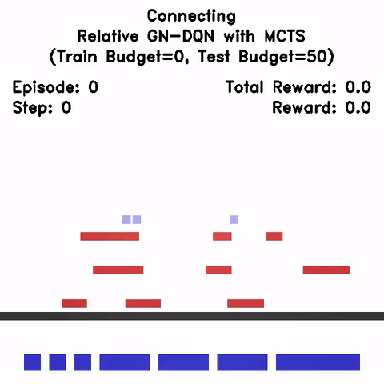
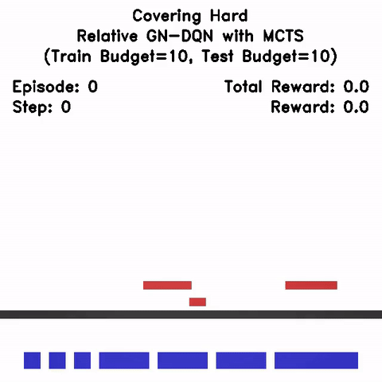
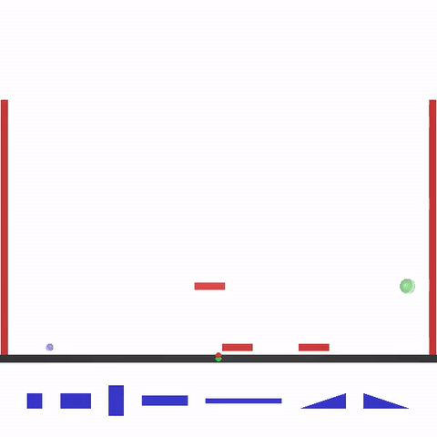

# Construction Environments

This is the code necessary to run the Construction environments introduced by
[Bapst et al. (2019)](https://arxiv.org/abs/1904.03177) and
[Hamrick et al. (2020)](https://arxiv.org/abs/1912.02807).



## Overview

These Construction tasks are provided through pre-packaged
[Docker containers](http://www.docker.com).

This package consists of support code to run these Docker containers. You
interact with the task environment via a
[`dm_env`](http://www.github.com/deepmind/dm_env) Python interface.

Please see the [documentation](docs/index.md) for more detailed information on
the available tasks, actions and observations.

## Requirements

The Construction tasks are intended to be run on Linux and are not officially
supported on Mac and Windows. However, they can in principle be run on any
platform (though installation may be more of a headache). In particular, on
Windows, you will need to install and run the Construction tasks with
[WSL](https://docs.microsoft.com/en-us/windows/wsl/about).

The Construction tasks require [Docker](https://www.docker.com),
[Python](https://www.python.org/) 3.6.1 or later and a x86-64 CPU with SSE4.2
support. We do not attempt to maintain a working version for Python 2.

Note: We recommend using
[Python virtual environment](https://docs.python.org/3/tutorial/venv.html) to
mitigate conflicts with your system's Python environment.

Download and install Docker:

*   For Linux, install [Docker-CE](https://docs.docker.com/install/)
*   Install Docker Desktop for
    [OSX](https://docs.docker.com/docker-for-mac/install/) or
    [Windows](https://docs.docker.com/docker-for-windows/install/).

## Quickstart

After installing Docker and Python (see above), install the Construction tasks
by running the following command from the root of this repository:

```
pip install .
```

Then, from a Python interpreter:

```python
>>> import dm_construction
>>> env = dm_construction.get_environment("covering", difficulty=0)
>>> time_step = env.reset()
>>> print(time_step.step_type)
StepType.FIRST
```

This may take a little while the first time you run it, as this command will
automatically download the Docker container for the environment, start
it, and connect to it through Python. For more details, see the
[documentation](docs/index.md) and the
[Environment Loading](https://github.com/deepmind/dm_construction/blob/master/demos/environment_loading.ipynb)
notebook demo.

### Demos

If you wish to run the [demos](https://github.com/deepmind/dm_construction/blob/master/demos/),
you will also need to install [ffmpeg](https://ffmpeg.org/). Here are some
options for how to install ffmpeg:

* Cross-platform with [Anaconda](https://docs.anaconda.com/anaconda/install/): `conda install ffmpeg`
* Ubuntu: `apt-get install ffmpeg`
* Mac with [Homebrew](https://brew.sh/): `brew install ffmpeg`

Next, run the following command to install a few additional dependencies:

```
pip install ".[demos]"
```

## Troubleshooting

See below for some common errors and how to fix them.

### Protobuf

```
AttributeError: module 'google.protobuf.descriptor' has no attribute '_internal_create_key'
```

Sometimes the protobuf library can get into a bad state if you have tried to
update it. To fix this, do `pip uninstall protobuf` then `pip install protobuf`
to fix it.

### Docker

```
requests.exceptions.ConnectionError: ('Connection aborted.', FileNotFoundError(2, 'No such file or directory'))
```

This likely means Docker is not installed, or not running. Make sure you have
both installed it and started the Docker engine. You can test if the Docker
engine is running by running `docker info`.

### Shapely

There is currently [a bug](https://github.com/Toblerity/Shapely/issues/888) in
the 1.7.0 version of the Shapely library that may cause problems on Mac and
Windows.

* Mac OSX (`OSError: Could not find lib c or load any of its variants`): see
  [this StackOverflow question](https://stackoverflow.com/questions/39991765/shapely-oserror-could-not-find-lib-c-or-load-any-of-its-variants)
  for a suggested fix.

* Windows (`FileNotFoundError: Could not find module 'geos.dll' (or one of its
  dependencies)`): the Construction tasks are not officially supported on
  Windows. Please run the library using
  [WSL](https://docs.microsoft.com/en-us/windows/wsl/about) instead.

## References

Bapst, V., Sanchez-Gonzalez, A., Doersch, C., Stachenfeld, K., Kohli, P.,
Battaglia, P., & Hamrick, J. (2019, May).
[Structured agents for physical construction](https://arxiv.org/abs/1904.03177).
In International Conference on Machine Learning (pp. 464-474).

Hamrick, J. B., Bapst, V., Sanchez-Gonzalez, A., Pfaff, T., Weber, T., Buesing,
L., & Battaglia, P. W. (2020).
[Combining Q-Learning and Search with Amortized Value Estimates](https://arxiv.org/abs/1912.02807).
ICLR 2020.
